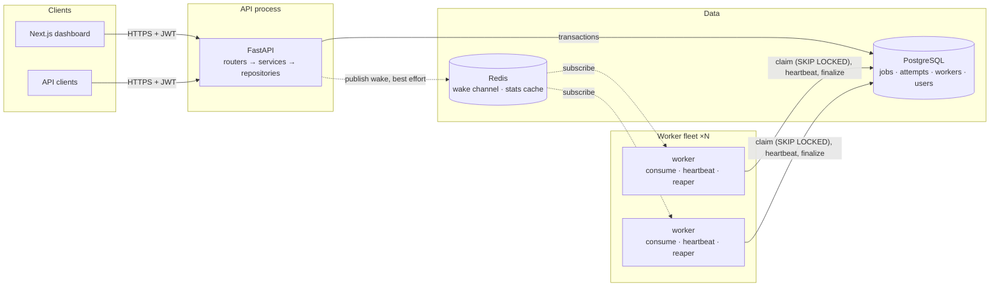
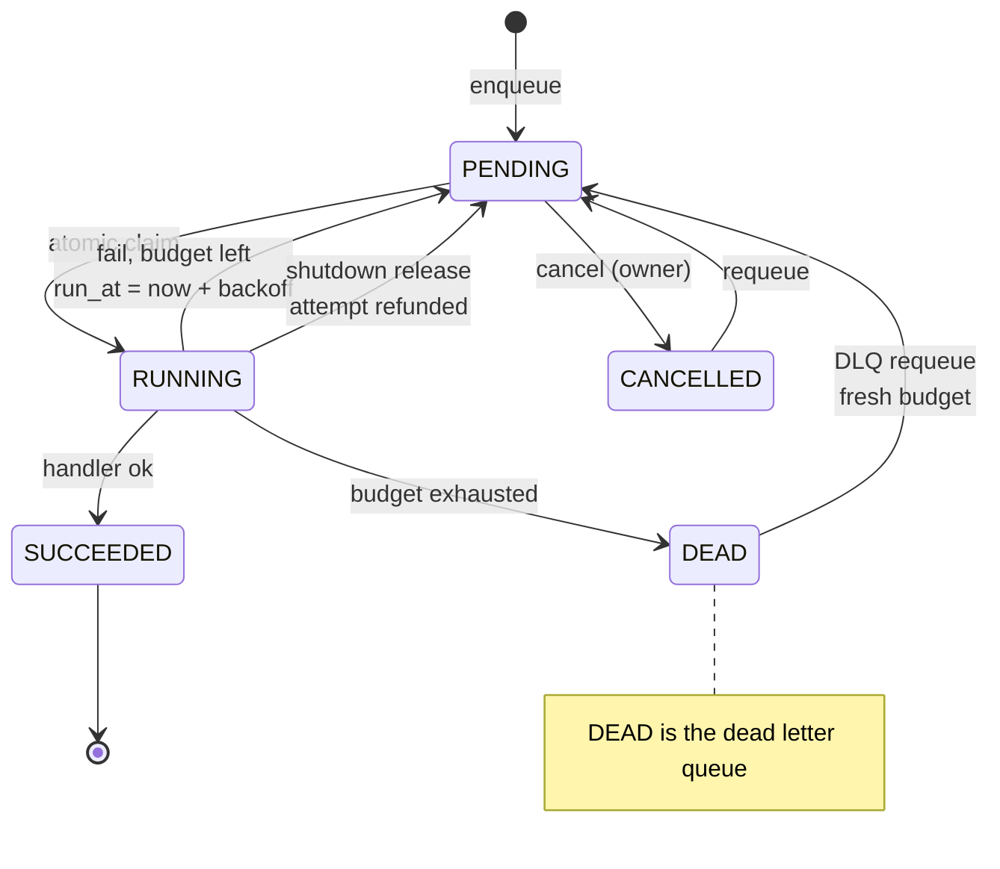
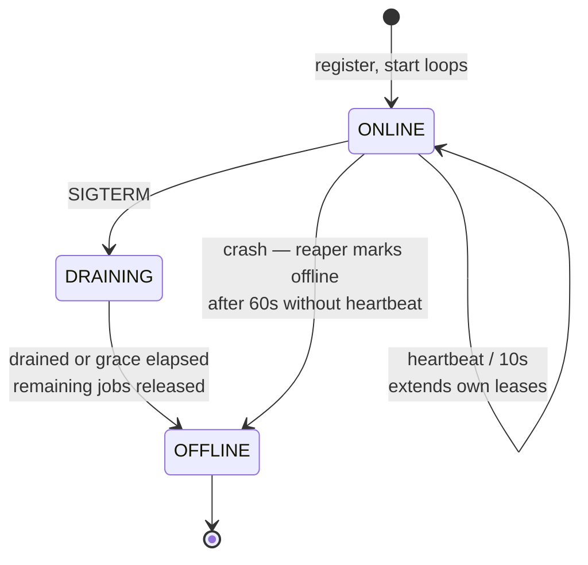
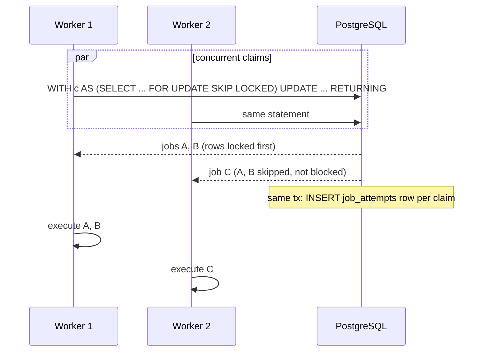
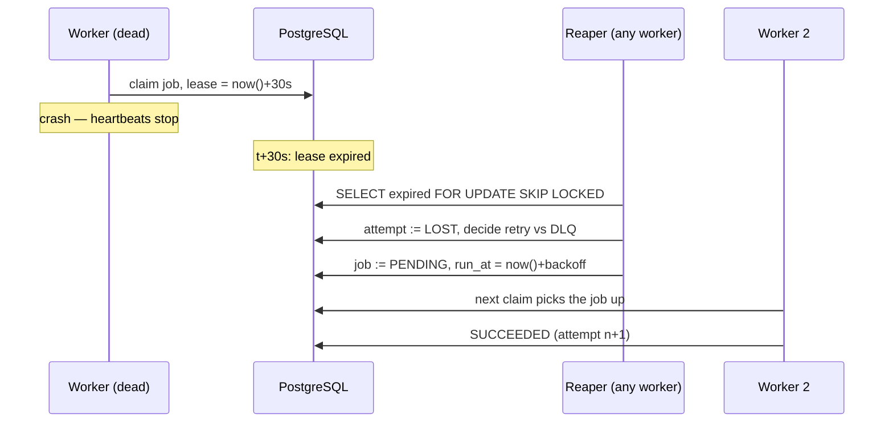
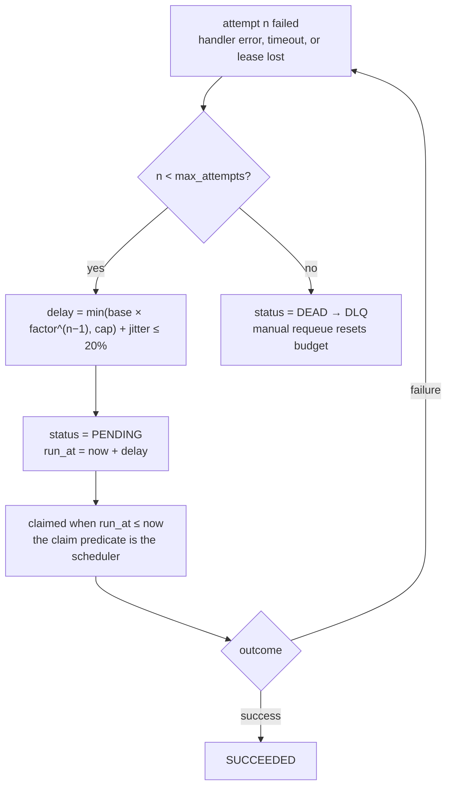
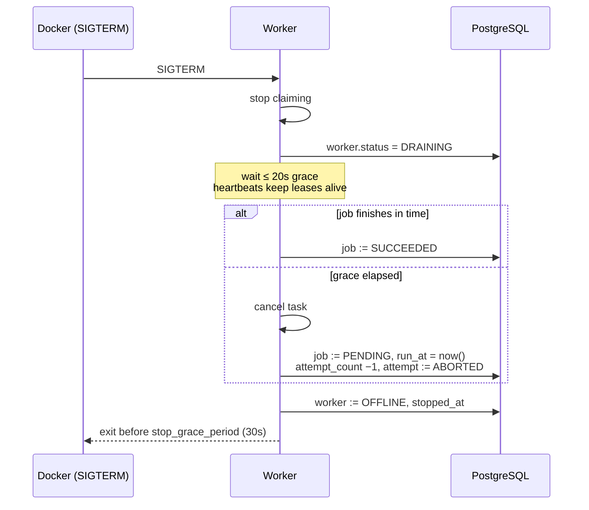
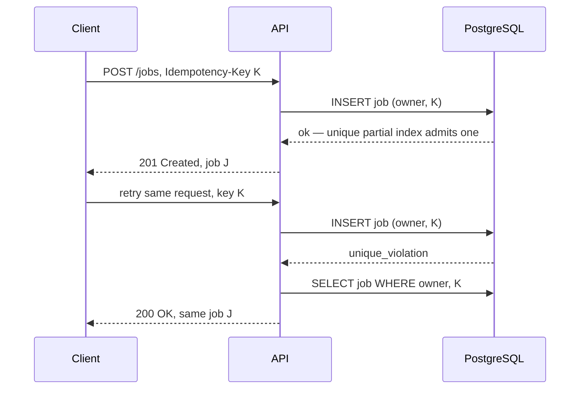
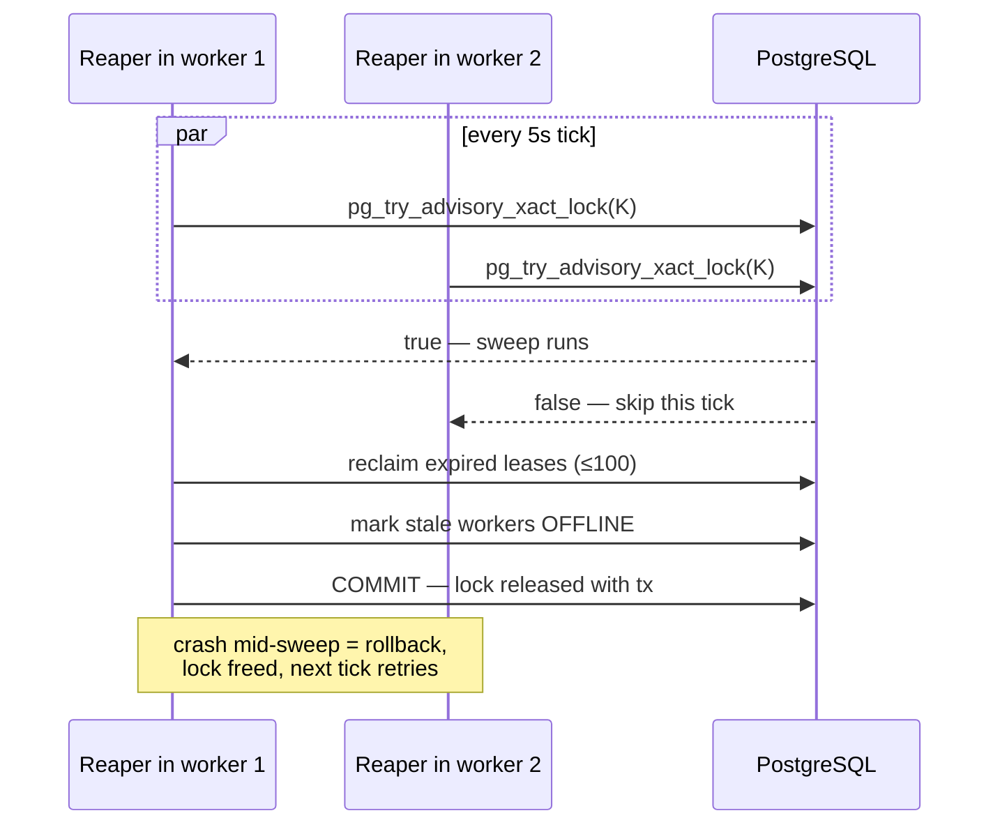

# Chronos — Diagrams

Mermaid sources. Render on GitHub, or export to PDF with
`mmdc -i DIAGRAMS.md -o diagrams.pdf` (mermaid-cli).

## 1. System architecture



## 2. Job lifecycle



## 3. Worker lifecycle



## 4. Claim sequence (two workers, no double-claim)



## 5. Lease expiry recovery



## 6. Retry flow



## 7. Graceful shutdown



## 8. Idempotency flow



## 9. Reaper coordination



## 10. Worker crash recovery (fencing)

```mermaid
sequenceDiagram
  participant W as Worker (paused / zombie)
  participant PG as PostgreSQL
  participant R as Reaper

  W->>PG: claim job, locked_by = W
  Note over W: 40s stall — no heartbeats
  R->>PG: lease expired → attempt LOST,<br/>job PENDING, locked_by = NULL
  Note over W: resumes, handler completes
  W->>PG: UPDATE ... WHERE status='running'<br/>AND locked_by = W
  PG-->>W: 0 rows — lease lost
  W->>W: log lease_lost, discard result
  Note over PG: reaper's verdict stands.<br/>State consistent; side effects may<br/>duplicate — at-least-once by design
```
